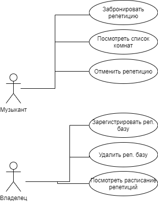
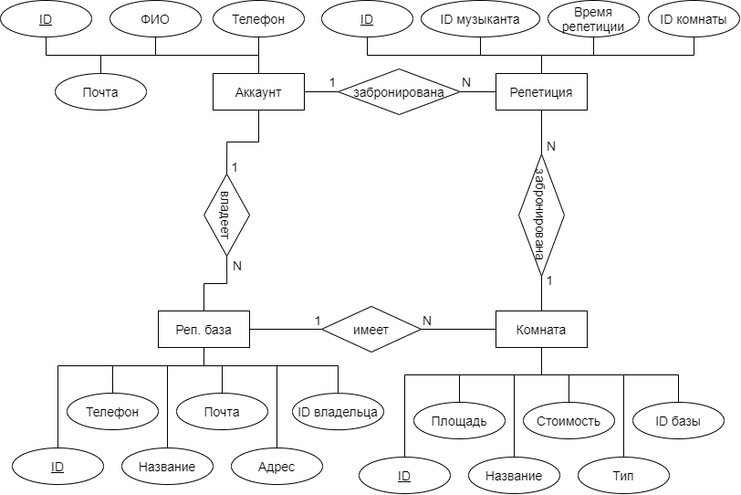

# HearBase

## Цель работы

Разработать веб-приложение, содержащее информацию о репетиционных базах с возможностью для музыканта бронировать или отменять свои репетиции,
а для владельца репбазы - отслеживать записи на свою репбазу.

## Функциональные требования

Для всех:
- регистрация аккаунта;
- авторизация;
- удаление аккаунта.

Для обычного музыканта:
- просмотр списка комнат с соответствующими реп. базами;
- бронь репетиции;
- отмена репетиции;

Для владельца:
- регистрация реп. базы;
- просмотр всех репетиций на реп. базе;
- удаление реп. базы.

## Use-Case диаграмма

## Экраны будущего приложения

## ER диаграмма сущностей

