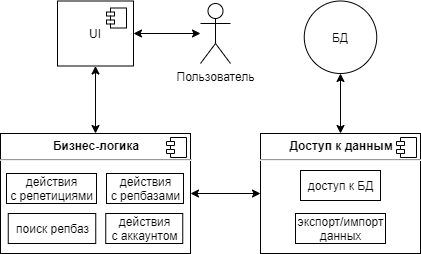
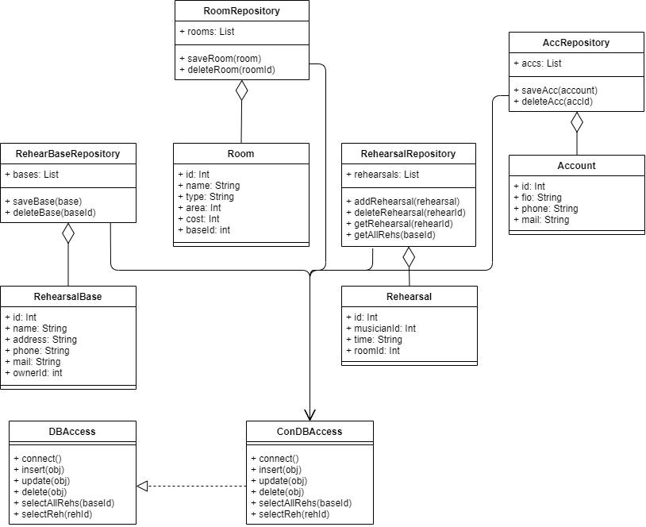
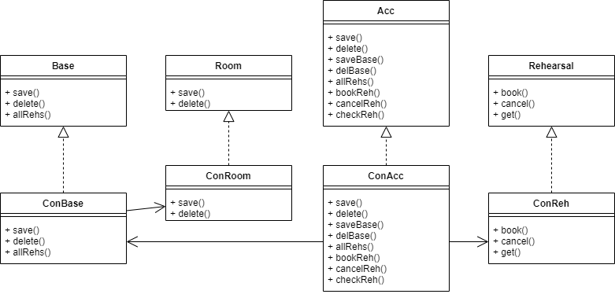
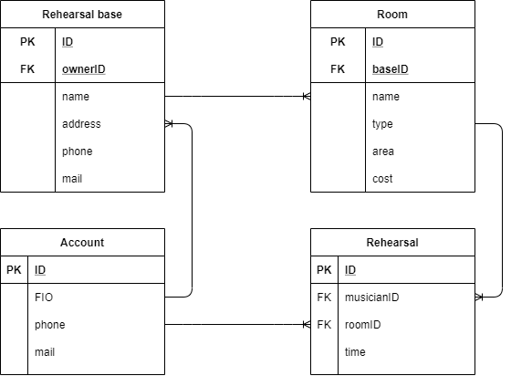
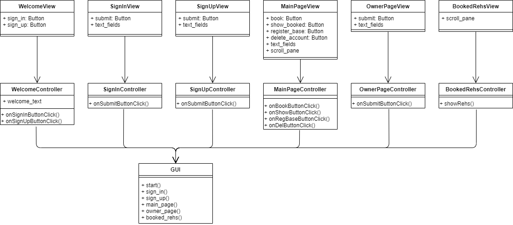

# HearBase

## Идея

Приложение, содержащее информацию о репетиционных базах с возможностью для музыканта бронировать или отменять свои репетиции,
а для владельца репбазы - отслеживать записи на свою репбазу.

## Предметная область

Предметная область - музыка (музыкальная индустрия).
Пользователями приложения могут являться как обычные музыканты, ищущие себе место для репетиций,
так и владельцы, отслеживающие записи на свою репбазу.
Репетиционные базы состоят из одной или нескольких комнат. Каждую из этих комнат может забронировать группа (музыкант)
на определённое время.

## Анализ аналогичных решений

| Название   | Можно посмотреть весь список репбаз | Вся необходимая инфа есть на превью | Наличие других городов (кроме мск) |
|------------|-------------------------------------|-------------------------------------|------------------------------------|
| MUSbooking | Нет | Да | Да |
| TONESKY    | Да | Нет (цены не на превью) | Нет |

## Целесообразность и актуальность

Проблема поиска места для репетиций является актуальной для любого музыканта, тем более группы.
В крупных городах есть достаточно много репетиционных баз. Все они имеют разные цены и характеристики.
Поэтому существует потребность в приложении, которое собирало бы воедино всю имеющуюся информацию о различных
репетиционных базах, таким образом освобождая музыкантов от необходимости вручную искать и изучать каждую репбазу,
заходить на их сайты, звонить лично, чтобы забронировать репетицию и т. д.

## Use-Case диаграмма

## ER диаграмма сущностей

## Архитектурные характеристики, важные для проекта

В последствии в приложение можно также добавить возможность бронирования, например,
студий звукозаписи и танцевальных залов. А также добавить другие города. 

**Тип приложения:** Desktop  
**Технологический стек:** Kotlin (JDBC), PostgreSQL

## Верхнеуровневое разбиение на компоненты

## UML доступа к данным

## UML бизнес-логики

## Сущности БД

## Диаграмма GUI

